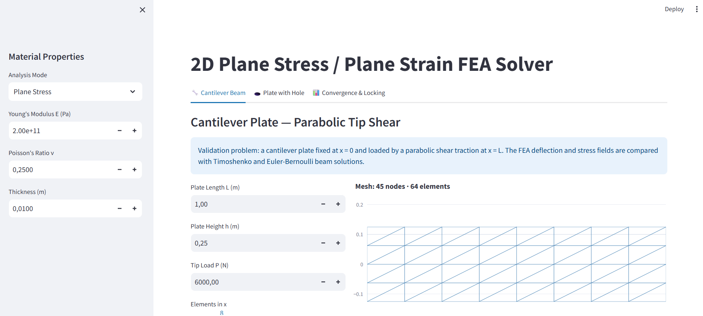

# 2D FEM Solver — CST Elements (Validation & Analysis App)

This project implements a 2D finite element solver using Constant Strain Triangle (CST) elements for linear elasticity problems. The solver is integrated into an interactive Streamlit application for validation, visualization, convergence analysis, and volumetric locking investigation.

---

## Problem Overview

The objective of this project is to build a complete finite element analysis pipeline, from mesh generation to post-processing, and validate the numerical results against known analytical solutions.

The solver is used to study:

- 2D linear elastic structural response
- CST element behavior
- Stress recovery
- Mesh refinement convergence
- Volumetric locking in plane strain
- Interactive visualization through a web app

---

## Theoretical Background

The finite element method approximates the displacement field over a discretized domain. For linear static elasticity, the governing system is:

\[
\mathbf{K}\mathbf{u} = \mathbf{R}
\]

where:

- \(\mathbf{K}\) is the global stiffness matrix
- \(\mathbf{u}\) is the global displacement vector
- \(\mathbf{R}\) is the global load vector

Each CST element has three nodes and two displacement degrees of freedom per node:

\[
[u_1, v_1, u_2, v_2, u_3, v_3]
\]

The CST element assumes a linear displacement field inside each triangular element. As a result, the strain field is constant within the element:

\[
\boldsymbol{\varepsilon} = \mathbf{B}\mathbf{u}_e
\]

and the corresponding stress field is computed as:

\[
\boldsymbol{\sigma} = \mathbf{D}\boldsymbol{\varepsilon}
\]

where:

- \(\mathbf{B}\) is the strain-displacement matrix
- \(\mathbf{D}\) is the constitutive matrix
- \(\mathbf{u}_e\) is the element displacement vector

The element stiffness matrix is computed as:

\[
\mathbf{k}_e = t A \mathbf{B}^T \mathbf{D}\mathbf{B}
\]

where \(t\) is the plate thickness and \(A\) is the element area.

The element stiffness matrices are assembled into the global stiffness matrix using the global degree-of-freedom mapping. Dirichlet boundary conditions are applied by elimination, and the reduced system is solved for the free degrees of freedom.

---

## Features

- 2D linear elasticity solver
- Plane stress and plane strain modes
- Constant Strain Triangle elements
- Rectangular structured mesh generation
- Quarter plate-with-hole mesh generation
- Sparse global stiffness matrix assembly
- Consistent distributed load vectors
- Dirichlet boundary conditions by elimination
- Stress recovery for \(\sigma_{xx}\), \(\sigma_{yy}\), and \(\tau_{xy}\)
- Von Mises stress visualization
- Interactive Streamlit user interface
- Mesh preview with boundary tag visualization
- CSV export of displacement and stress results
- Convergence study
- Volumetric locking investigation

---

## Validation Problem 1: Cantilever Plate

The first validation problem is a cantilever plate subjected to a parabolic shear traction at the free end.

The geometry is a rectangular plate fixed at:

\[
x = 0
\]

and loaded at:

\[
x = L
\]

The applied traction is:

\[
t_y(y) = \frac{3P}{2h}\left(1 - \frac{4y^2}{h^2}\right)
\]

This traction distribution is integrated consistently along the loaded edge using one-dimensional shape functions and Gauss quadrature.

The FEM results are compared against:

- Euler-Bernoulli beam theory
- Timoshenko beam theory

The app provides the following cantilever validation plots:

1. Deflection \(v(x)\) along the neutral axis
2. Bottom fiber normal stress \(\sigma_{xx}\)
3. Deformed mesh with von Mises stress
4. Shear stress \(\tau_{xy}\) across the beam depth at mid-span

This problem is useful for checking the global stiffness assembly, boundary conditions, load vector implementation, and stress recovery.

---

## Validation Problem 2: Plate with Circular Hole

The second validation problem is a plate with a circular hole under uniaxial tension.

The full plate has a central circular hole, but only one quarter of the domain is modeled using symmetry. The computational domain is:

\[
0 \leq x \leq W, \qquad 0 \leq y \leq H, \qquad x^2 + y^2 \geq R^2
\]

The symmetry boundary conditions are:

- \(v = 0\) on \(y = 0\)
- \(u = 0\) on \(x = 0\)

A uniform tensile traction is applied on the right boundary.

The stress concentration around the hole is compared with the Kirsch analytical solution. For an infinite plate with a circular hole under uniaxial tension, the theoretical stress concentration factor is:

\[
K_t = \frac{\sigma_{\theta\theta}}{\sigma_\infty} = 3
\]

The app provides the following plate-with-hole validation plots:

5. \(\sigma_{\theta\theta}\) along the hole boundary compared with Kirsch
6. \(\sigma_{xx}\) along the x-axis showing stress decay
7. Deformed mesh with von Mises stress

This problem validates the plate-with-hole mesh, symmetry boundary conditions, stress transformation, and stress concentration behavior.

---

## Convergence Study

The app includes an h-refinement convergence study for the cantilever problem.

The mesh is refined using:

\[
nx = [2, 4, 8, 16, 32]
\]

For each mesh, the tip deflection is computed and compared with the Timoshenko analytical solution. The relative error is plotted against the number of elements on a log-log scale.

The expected behavior for CST elements is approximately first-order convergence in displacement:

\[
\text{error} \sim h^p
\]

with:

\[
p \approx 1
\]

In practice, the observed convergence rate may deviate from exactly one because CST elements are relatively stiff in bending-dominated problems and because the numerical 2D elasticity solution is being compared against a one-dimensional beam theory reference.

The app also includes a plate-with-hole convergence study, where the maximum hoop stress near the hole is compared against the Kirsch value:

\[
\frac{\sigma_{\theta\theta}^{max}}{\sigma_\infty} = 3
\]

---

## Volumetric Locking Study

The app includes a volumetric locking investigation in plane strain.

The cantilever problem is solved for the following Poisson's ratios:

\[
\nu = [0.3, 0.4, 0.45, 0.49, 0.499, 0.4999]
\]

For each value of \(\nu\), the app computes:

- the normalized tip deflection
- the condition number of the free-DOF stiffness matrix

As \(\nu \to 0.5\), the material approaches incompressibility. Under plane strain conditions, this imposes a strong volumetric constraint:

\[
\varepsilon_{vol} \approx 0
\]

The CST element is particularly susceptible to volumetric locking because it has a constant strain field and limited displacement degrees of freedom. Each element effectively imposes an incompressibility constraint, but the displacement field does not have enough flexibility to satisfy these constraints without becoming artificially stiff.

The result is that the computed displacement becomes much smaller than expected, and the stiffness matrix becomes increasingly ill-conditioned.

The app shows this behavior through:

- normalized tip deflection vs. Poisson's ratio
- condition number vs. Poisson's ratio

Possible remedies for volumetric locking include:

- mixed displacement-pressure formulations
- reduced or selective integration
- hybrid elements
- enhanced or assumed strain formulations

---

## Running the App with Docker

To build and run the Streamlit app using Docker, run:

```bash
docker compose up
```

After the container starts, open the app in a browser at:

```text
http://localhost:8501
```

The app can be used to run the cantilever validation, plate-with-hole validation, convergence studies, and volumetric locking investigation.

---

## Running Tests

To run the unit tests inside Docker, use:

```bash
docker compose run fea-solver python -m pytest tests/ -v
```

The test suite checks the main numerical components of the solver, including element behavior, global assembly, load vectors, and solver consistency.

All tests should pass before deployment.

---

## CSV Export

The app includes CSV export functionality for numerical results.

For the cantilever problem, the app can export:

- nodal displacements
- element stresses

These files can be downloaded directly from the Streamlit interface after running the analysis.

---

## Screenshot

A screenshot of the Streamlit app interface is included below:

```markdown

```

---

## Live App

The deployed public version of the app is available at:

```text
https://cst-fem-solver-fcepwhhpssmequ47uy3xcf.streamlit.app/
```

---

## Project Structure

```text
src/
  mesh.py
  elements.py
  assembly.py
  solver.py
  postprocess.py
  analytics.py

tests/
  test_elements.py
  test_assembly.py
  test_solver.py

app.py
Dockerfile
docker-compose.yml
requirements.txt
README.md
```

---

## Key Takeaways

This project demonstrates the full finite element workflow for 2D linear elasticity using CST elements. The implementation highlights both the usefulness and the limitations of simple triangular elements.

Main observations:

- CST elements are simple and efficient but limited in bending-dominated problems.
- Mesh refinement improves accuracy, but convergence may be slow.
- Stress concentration around a circular hole can be captured and compared with Kirsch theory.
- Near-incompressible plane strain problems produce volumetric locking.
- Proper validation requires both numerical tests and physical interpretation.

---

## Author

Wydem Santos